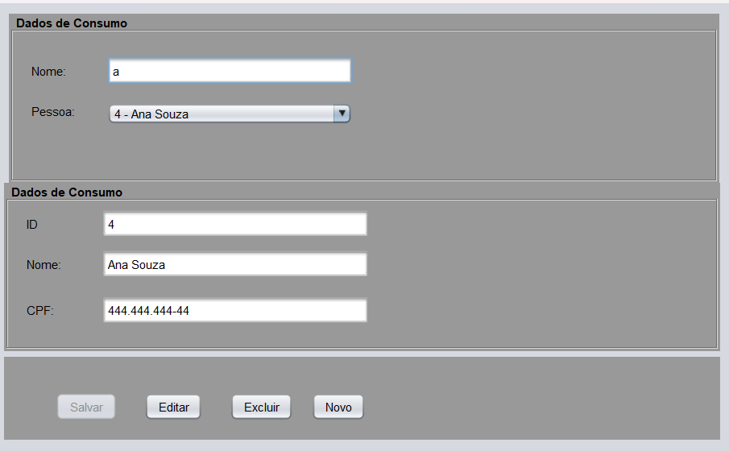
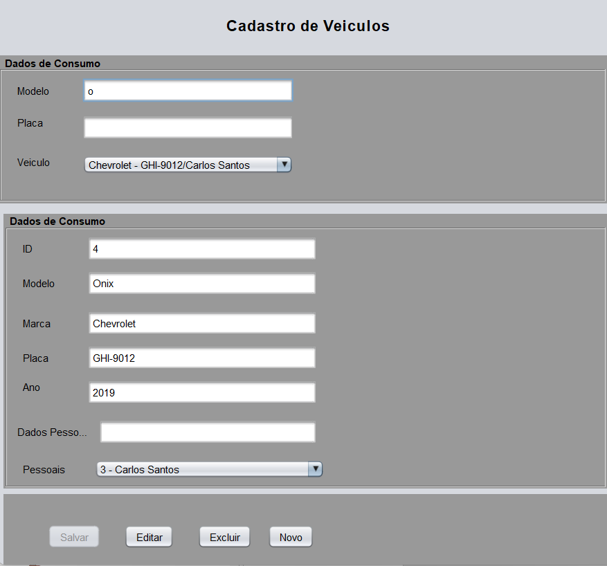
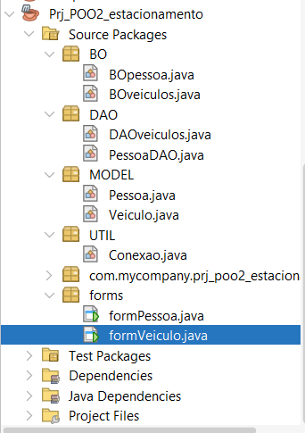
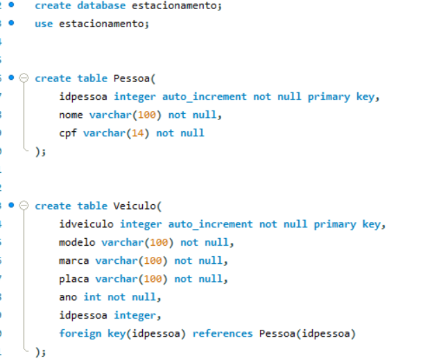

# 🚗 Sistema de Gerenciamento de Estacionamento


Este projeto é uma aplicação desktop desenvolvida em **Java** com interface gráfica para o gerenciamento de um estacionamento. O sistema permite o controle completo do cadastro de clientes (pessoas) e a vinculação de seus respectivos veículos, utilizando um banco de dados relacional MySQL para a persistência das informações.

## 🎯 Objetivos do Projeto

O objetivo principal deste software é fornecer uma interface gráfica intuitiva e um backend robusto para automatizar operações de registro em um estacionamento. O sistema garante:
* Integridade dos dados relacionais entre o proprietário e o veículo.
* Uma interface amigável para operações de CRUD (Criar, Ler, Atualizar, Excluir).
* Separação de responsabilidades no código (Arquitetura em Camadas), facilitando a manutenção e escalabilidade.

## 🛠️ Arquitetura e Funcionamento do Código

O projeto foi construído utilizando um padrão de arquitetura em camadas, separando as responsabilidades para manter o código limpo e organizado:

* **MODEL (Modelos de Domínio):** Contém as classes `Pessoa` e `Veiculo` que representam as entidades do sistema e refletem as tabelas do banco de dados[cite: 1, 2]. A classe Pessoa possui atributos como nome e CPF[cite: 1]. A classe Veículo gerencia detalhes como modelo, marca, placa, ano e está vinculada a um objeto Pessoa[cite: 2].
* **DAO (Data Access Object):** As classes `PessoaDAO` e `DAOveiculos` são responsáveis exclusivas pela comunicação com o banco de dados[cite: 7, 8]. Elas executam instruções SQL complexas (INSERT, UPDATE, DELETE, SELECT) utilizando `PreparedStatement` para garantir a segurança das queries[cite: 7, 8].
* **BO (Business Object):** As classes `BOpessoa` e `BOveiculos` funcionam como uma camada de regras de negócio e controle intermediário entre a interface gráfica e o banco de dados (DAO)[cite: 9, 10].
* **FORMS (Visão/View):** Desenvolvidas com JForm, as classes `formPessoa` e `formVeiculo` fornecem a interface de usuário. Elas possuem formulários integrados com botões de ação (Salvar, Editar, Excluir, Novo) e utilizam elementos como `JComboBox` para buscas dinâmicas[cite: 4, 6].
* **UTIL:** Contém a classe de configuração `Conexao`, que implementa o padrão JDBC para estabelecer a conexão com o banco de dados MySQL (`estacionamento`) utilizando o usuário `root`.

## ⚙️ Funcionalidades

* **Gestão de Pessoas:** Cadastro, edição, exclusão e consulta de clientes através de CPF ou Nome[cite: 4, 8].
* **Gestão de Veículos:** Cadastro de veículos e vinculação direta a um cliente (Pessoa) previamente cadastrado[cite: 6, 7].
* **Busca Dinâmica:** Pesquisa em tempo real de veículos por placa ou modelo e de pessoas por nome ou CPF, populando os dados automaticamente na tela[cite: 6, 7, 8].
* **Tratamento de Exceções:** Sistema de alertas visuais (`JOptionPane`) para informar o usuário sobre o sucesso ou falha das transações no banco de dados[cite: 7, 8].

---

## 📸 Capturas de Tela (Screenshots)

### 1. Tela de Cadastro de Pessoas
> *Gerenciamento de clientes com suporte a inserção e busca dinâmica.*

<div align="center">
 
  
</div>

### 2. Tela de Cadastro de Veículos
> *Vinculação de automóveis aos proprietários utilizando componentes de seleção inteligente.*

<div align="center">
  
  
</div>

---

## 🚀 Como Executar o Projeto

### Pré-requisitos
* Java Development Kit (JDK) 8 ou superior.
* Banco de Dados MySQL Server instalado e rodando na porta padrão (`3306`).
* Driver JDBC do MySQL (MySQL Connector/J) adicionado às bibliotecas (classpath) do projeto.

### Configuração do Banco de Dados
1. Abra o seu gerenciador MySQL (ex: MySQL Workbench, DBeaver, ou via terminal).
2. Crie um banco de dados chamado `estacionamento`.
3. Crie as tabelas `Pessoa` (idpessoa, nome, cpf) e `Veiculo` (idveiculo, modelo, marca, placa, ano, idpessoa).

### Passos para compilação
1. Clone este repositório:
   ```bash
   git clone [https://github.com/seu-usuario/seu-repositorio.git](https://github.com/seu-usuario/seu-repositorio.git)


   ---

## 💻 Ambiente e Tecnologias

> *Principais ferramentas e tecnologias que dão suporte ao funcionamento do sistema.*

<div align="center">
  
  
</div>
